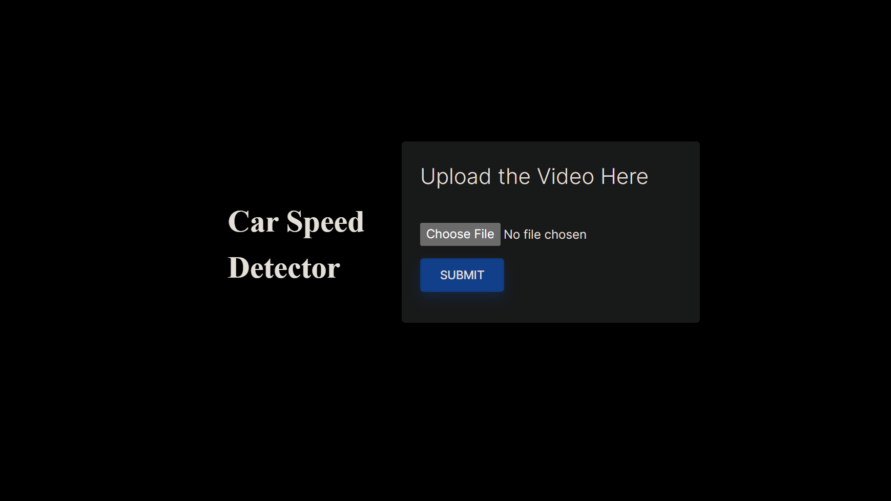

# Car Speed Detector

A Simple Data Science based project that detects the speed of the Car using OpenCV and Flask (Interaction between frontend and backend)




### Dependencies
1. OpenCV-Python
2. Flask
3. Dlib
4. Numpy

### Clone Repository
```sh
    git clone https://github.com/Khailas12/Car-Speed-Detector
```

### cd (change directory) into `cd V-core`
Make sure that the directory is set as `V-core` because I've made bunch of implementations including dataset connection with the exact name in path section.

### Installation
```sh
$ python pip install -r requirements.txt
```
### How to Run?
```sh
$ python app.py
```
